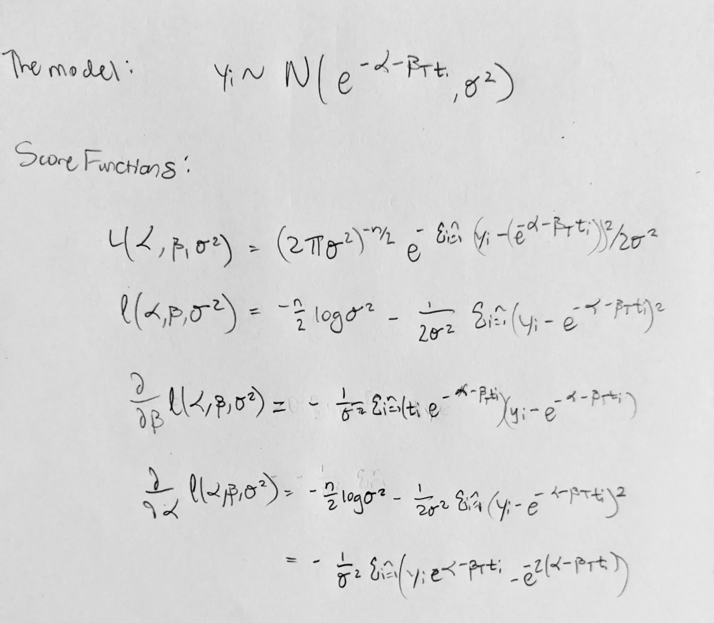

```{r setup, include=FALSE}
knitr::opts_chunk$set(echo = TRUE)
```


```{r libraries, echo=FALSE, warning=FALSE, message=FALSE}
library(tidyverse)
library(MASS)
library(magrittr)
library(ggpubr)
```

```{r data}
corn <- read.table("~/generalized_regression_models/hw2/corn.txt", quote="\"", comment.char="")
names(corn) <- c("amt_fert", "block_num", "obs_yield")
corn$block_num %<>% factor()
```

### Part A

```{r}
summary(aov(obs_yield ~ block_num + amt_fert, data=corn))
```

The sum of squares associated with variation: between blocks is 6745, with nitrogen is 5819, and with departures from additivity is 16930.


### Part B

Since the block number factor is significant at level $\alpha=0.05$ blocking does appear to have been effective in this experiment.($p=0.000625$)

### Part C

```{r}
# make sequence of gammas and resy df to hold data
gamma_nums <- seq(1,30,by=0.1)
resy <- data.frame(
  gammas =gamma_nums, 
  rss = rep(0, length(gamma_nums)))
# function that gives the residual sums of squares
get_rss <- function(the_gamma){
  anova(lm(obs_yield ~ log(the_gamma+amt_fert), data=corn))["Residuals", "Sum Sq"]
}
# use map to combine feed gamma values into rss function
resy$rss <- map_dbl(resy$gammas, ~get_rss(.x))
# find least squares estimate
(lse <- resy$gammas[which(resy$rss==min(resy$rss))])
# make plot
ggplot(resy)+ 
  geom_point(data=resy,aes(x=gammas, y=rss), color="purple")+
  theme_light()+
  ggtitle("Residual Sum of Squares vs. Gammas")+
  xlab("Gamma")+
  ylab("Residual Sum of Squares")
```

The least squares estimate is 4.3.

### Part D

```{r}
mod <- lm(obs_yield ~ log(lse+ amt_fert), data=corn)
the_bc <- boxcox(mod)#, lambda = seq(0.5,2.5, by=0.1))
(mle_lambda <- the_bc$x[which(the_bc$y==max(the_bc$y))])
```

The model in C cannot be substantially improved by response transformation using the Box-Cox method. Though $\hat{\lambda}_{MLE}=1.878788$, $1$ is within our $95\%$ confidence interval. 

Since $\lambda=1$ is equivalent to using the original data this tells us that the transformation is unnecessary. 

### (Part D Continued)

```{r}
# transform data
transformed <- ((corn$obs_yield^mle_lambda)-1)/mle_lambda
# original plot
p_before <- ggplot()+
  geom_point(aes(x=log(lse+corn$amt_fert), y=corn$obs_yield), color="red")+
    stat_smooth(aes(x=log(lse+corn$amt_fert), y=corn$obs_yield), color="black", method = "lm", se=FALSE)+
  theme_light()+
  ggtitle("Before Transformation")+
  ylab("untransformed yield")+
  xlab("log(Nitrogen + LSE)")
# plot with transformed data
p_after <- ggplot()+
  geom_point(aes(x=log(lse+corn$amt_fert), y=transformed), color="blue")+
  stat_smooth(aes(x=log(lse+corn$amt_fert), y=transformed),color="black", method = "lm", se=FALSE)+
  theme_light()+
  ggtitle("After Transformation")+
  xlab("log(Nitrogen + LSE)")+
  ylab("transformed yield")
# arrange
ggarrange(p_before, p_after, ncol=2, nrow = 1)

```


Just to be thorough I have created plots with transformed and untransformed data. As you can see, the shape of the data is approximately the same. This further provides evidence against using a Box-Cox transformation.

### Part E

Based on my analysis higher amounts of Nitrogen fertilizer appear to be associated with greater corn yield, after accounting for differences between blocks. 


# Problem 2


```{r data2}
beans <- data.frame(
  temps = c(0, 10, 20, 0, 10, 20, 0, 10, 20, 0, 10, 20),
  weeks = c(2,2,2,4,4,4,6,6,6,8,8,8),
  aa_loss = c(45,45,34,47,43,28,46,41,21,46,37,16)
)
beans$temps %<>% factor()
```


### Part A




```{r model}
mod2 <- glm(aa_loss ~ temps:weeks, family=gaussian(link = "log"), data = beans)
summary(mod2)
```

Printed above is the summary from this model. Each temperature factor grouping has it's own row along with the intercept. For the 0 degrees Fahrenheit group the coefficient was not significant ($p=0.842286$) but each of the other coefficients were significant, including the intercept.

### Part B

```{r}
betas <- c(0.0007716,0.0236121,0.1329785)
log(2)/betas
```

For the 0 degrees Fahrenheit group we can argue that the ascorbic acid concentration remains the same indefinitely due to zero being within the confidence interval for the estimate of the beta coefficient. However I'll move forward under the assumption that we can use the given estimates.

Since $E(Y)=e^{-\alpha-\beta_Tt_i}$ and $e^{-\alpha}$ is our initial concentration we want to find where $e^{-\beta_Tt_i}=2$

By rearranging we can see that this occurs at $t_i=\frac{log(2)}{\beta_T}$

Solving for t we find that the ascorbic acid concentration is expected to halve for 

* 0 degrees Fahrenheit after 898.34 weeks
* 10 degrees Fahrenheit after 29.36 weeks
* 20 degrees Fahrenheit after 5.21 weeks

I considered that using the Delta method or Fieller's may be best for finding the confidence intervals. However, I don't know that I believe that level of complexity is warranted here.

## Problem 3

Based off of this model we can say that there may be some correlation between education and extroversion based on the change in p-value and estimate for x1 (education) when it is regressed with x2 (extroversion) vs. when it is not included. However the difference is quite small and in both models education is not a significant predictor of sales performance, while extroversion is a significant predictor. This makes it difficult to get any good information about x2 (education) because it does not have evidence of a relationship with our y variable (sales performance).
