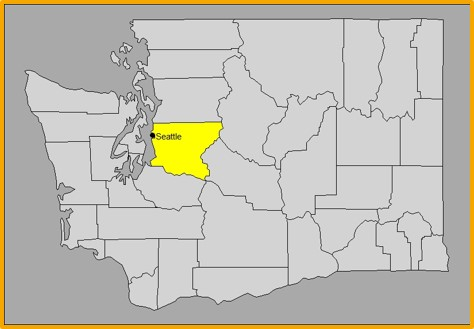
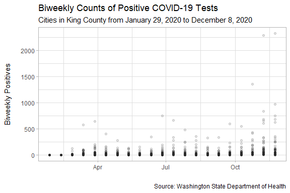

## COVID-19 Cases in King County, Washington

This project investigates factors that may help explain positive COVID-19 case count fluctuations from late January to early December of 2020 in King County, Washington. 

  

Three primary models were explored: Poisson, quasi-Poisson, and negative binomial. The negative binomial model was determined to be the best fit, though delving further into zero-inflated models and serial autocorrelation is suggested. City population size, rate of people tested, number of deaths, and week start date were all consistently significant (alpha=0.05) predictors in the models. Age group was more complex but the results affirm the idea that older age groups, particularly individuals 70 and above, may be more susceptible to the virus.

  

