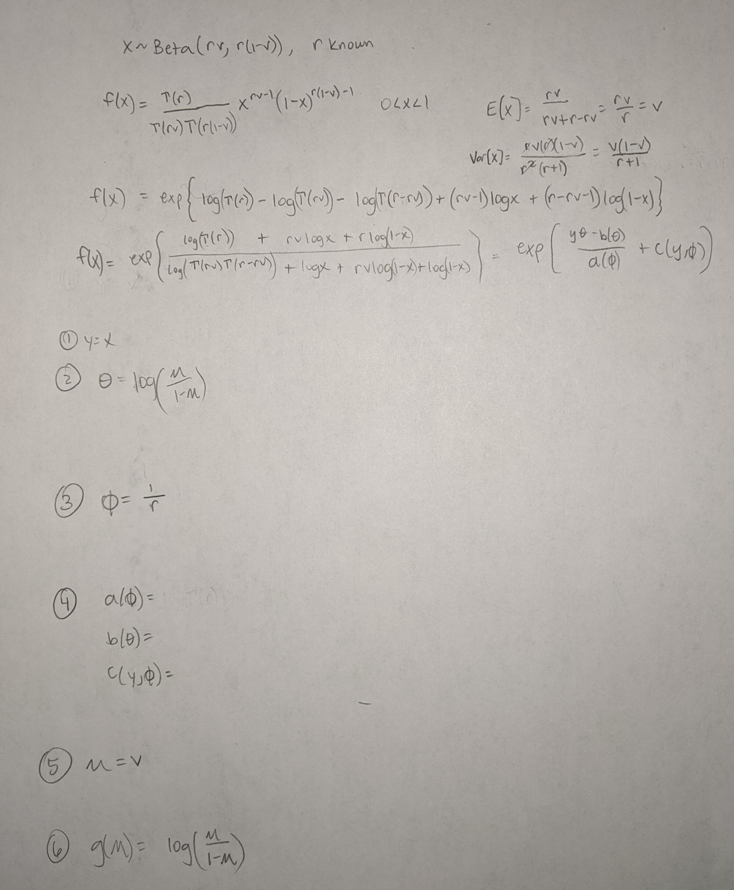

```{r setup, include=FALSE}
knitr::opts_chunk$set(echo = TRUE)
library(tidyverse)
library(magrittr)
```

# Problem 1

```{r, echo=FALSE}
#Load and manipulate data
birth <- read.table("C:/Users/erick/Downloads/birth.txt", quote="\"", stringsAsFactors=TRUE)
# fix column names
names(birth) <- c("family_size", "birth_order", "MM", "MF", "FM", "FF")
# make sex sequence a variable
birth_long <- birth %>% pivot_longer(c("MM", "MF", "FM", "FF"), names_to = "sex_seq", values_to = "response")
```

## Part A

#### i)

```{r, echo=FALSE}
modi <- lm(response~family_size + birth_order + sex_seq, data=birth_long)
deviance(modi)
```

#### ii)


```{r, echo=FALSE}
#First create a dataset with birth order reversed.
birth_reversed <- birth_long %>%
  mutate(birth_order = recode(birth_order, 
                              "1-2" = "2-1",
                              "2-3" = "3-2",
                              "3-4" = "4-3",
                              "4-5" = "5-4",
                              "5-6" = "6-5"),
         sex_seq = recode(sex_seq,
                          "MF" = "FM",
                          "FM" = "MF"))
```


```{r, echo=FALSE}
#Now find the residual sum of squares.
modii <- lm(response~family_size + birth_order + sex_seq, data=birth_reversed)
deviance(modii)
```

#### iii)

```{r, echo=FALSE}
modiii <- lm(response~family_size*birth_order + sex_seq, data=birth_long)
deviance(modiii)
```

#### iv)

```{r, echo=FALSE}
modiv <- lm(response~family_size*birth_order + sex_seq, data=birth_reversed)
deviance(modiv)
```

## Part B

```{r, echo=FALSE}
summary(modi)
summary(modii)
```

These models are the same except for the interpretation of them. The sex sequence is not significant in either model, only the birth order is. Since the birth order has the same levels just with different titles, this makes sense. For the second model you would talk about the distance in time from the second child to the first child. In the second model you'd talk about the distance in teim from the first child to the second child. These are the same values. 

## Part C

```{r, echo=FALSE}
summary(modi)
logmodi <- lm(log(response)~family_size + birth_order + sex_seq, data=birth_long)
summary(logmodi)
# summary(modii)
# logmodiii <- lm(log(response)~family_size*birth_order + sex_seq, data=birth_reversed)
# summary(logmodiii)
```

I don't notice anything particularly unusual. I tried a transformation and found that transforming the response variable results in a higher adjusted R-squared and a higher F-statistic. The untransformed model is still a good fit but the transformed one is better.

## Part D

This data is really interesting for a few reasons. First, that the sex sequence doesn't have any significant effect on the mean interval in months between successive births in the same family. Family size and birth order however are both significant ($\alpha=0.05$). As family size increases we see a decrease in mean interval between successive births. Conversely, it seems that there is a greater time duration between later birth orders (i.e. 5-6) as compared to earlier birth orders (i.e. 2-3).

# Problem 2


```{r, echo=FALSE}
#Load Data: 
galaxy <- read.table("~/generalized_regression_models/midterm/galaxy.txt", quote="\"", comment.char="")
# change row and column names to fit given data
row.names(galaxy) <- seq(18, 1, by=-1)
names(galaxy) <- seq(1, 15, by=1)
# format for glm()
galaxy_long <- galaxy %>% pivot_longer(c("1", "2", "3", "4",
                                         "5", "6", "7", "8",
                                         "9", "10", "11", "12",
                                         "13", "14", "15"),
                                       names_to = "redshift", 
                                       values_to = "count") %>%
  mutate(brightness = rep(18:1, each=15))
galaxy_long$redshift <- as.integer(galaxy_long$redshift)
```

## Part A

#### Model 1: linear in $x_1$ and $x_2$

```{r, echo=FALSE}
# Create Model
linear <- glm(count ~
                redshift +
                brightness, 
              family=poisson(link=log), 
              data=galaxy_long)
summary(linear)
```


```{r, echo=FALSE}
# Residual Analysis
glm.evaluate=linear

rp=resid(glm.evaluate, "pearson")
rd=resid(glm.evaluate, "deviance")
rw=resid(glm.evaluate, "working")
rs=rstudent(glm.evaluate)
ra=3*(glm.evaluate$y^{2/3}-glm.evaluate$fit^{2/3})/glm.evaluate$fit^{1/6}/2

par(mfrow=c(2,3))
plot(glm.evaluate$fit,rp, main="Pearson")
plot(glm.evaluate$fit,rd, main = "deviance")
plot(glm.evaluate$fit,rw, main="working")
plot(glm.evaluate$fit,rs, main="student")
plot(glm.evaluate$fit,ra, main="ra")
plot(hatvalues(glm.evaluate), type="h", main="hat")
```

#### Model 2: quadratic in $x_1$ and $x_2$

```{r, echo=FALSE}
#Create Model:
quadratic <- glm(count ~
                   poly(redshift, 2) +
                   poly(brightness, 2),
                 family=poisson(link=log),
                 data=galaxy_long)
summary(quadratic)
```


```{r, echo=FALSE}
#Residual Analysis:
glm.evaluate=quadratic

rp=resid(glm.evaluate, "pearson")
rd=resid(glm.evaluate, "deviance")
rw=resid(glm.evaluate, "working")
rs=rstudent(glm.evaluate)
ra=3*(glm.evaluate$y^{2/3}-glm.evaluate$fit^{2/3})/glm.evaluate$fit^{1/6}/2

par(mfrow=c(2,3))
plot(glm.evaluate$fit,rp, main="Pearson")
plot(glm.evaluate$fit,rd, main = "deviance")
plot(glm.evaluate$fit,rw, main="working")
plot(glm.evaluate$fit,rs, main="student")
plot(glm.evaluate$fit,ra, main="ra")
plot(hatvalues(glm.evaluate), type="h", main="hat")
```


#### Model 3: cubic in $x_1$ and $x_2$


```{r, echo=FALSE}
# Create Model:
cubic <- glm(count ~ 
                poly(redshift, 3) + 
                poly(brightness, 3),
              family=poisson(link=log), 
              data=galaxy_long)
summary(cubic)
```


```{r, echo=FALSE}
#Residual Analysis:
glm.evaluate=cubic

rp=resid(glm.evaluate, "pearson")
rd=resid(glm.evaluate, "deviance")
rw=resid(glm.evaluate, "working")
rs=rstudent(glm.evaluate)
ra=3*(glm.evaluate$y^{2/3}-glm.evaluate$fit^{2/3})/glm.evaluate$fit^{1/6}/2

par(mfrow=c(2,3))
plot(glm.evaluate$fit,rp, main="Pearson")
plot(glm.evaluate$fit,rd, main = "deviance")
plot(glm.evaluate$fit,rw, main="working")
plot(glm.evaluate$fit,rs, main="student")
plot(glm.evaluate$fit,ra, main="ra")
plot(hatvalues(glm.evaluate), type="h", main="hat")
```

## Part B

```{r, echo=FALSE}
linear$aic
coef(linear)


quadratic$aic
coef(quadratic)

cubic$aic
coef(cubic)
```

Based on the plots, the estimated regression coefficients and AIC values, the quadratic and cubic models appear most appropriate. The quadratic model just barely edges the cubic model out though, in part because the coefficients make a little more intuitive sense but also because the AIC is slightly smaller. Here is a summary of the fit of the model:

```{r, echo=FALSE}
summary(linear)
```

# Problem 3


```{r, echo=FALSE}
#Load and manipulate data:
cotton <- read.table("~/generalized_regression_models/midterm/cotton.txt", quote="\"")
names(cotton) <- c("affected", "not_affected", "race", "sex", "smoking", "employment", "dust")
cotton <- cotton %>%
  mutate(race = recode(race,
                       "1" = "w",
                       "2" = "nw"),
         sex = recode(sex,
                      "1" = "m",
                      "2" = "f")) %>% 
  pivot_longer(c("affected", "not_affected"), names_to = "byss_prev", values_to = "count") %>%
  mutate(byss_prev = recode(byss_prev,
                            "affected" = "1",
                            "not_affected" = "0")) %>%
  uncount(weights = count)
cotton$byss_prev <- as.integer(cotton$byss_prev)
```


## Part A

```{r, echo=FALSE}
fit <- glm(byss_prev~., family = binomial, data=cotton)
summary(fit)
```

Based on these results smoking, employment, and dust are significant predictors for being affected by bysinnosis ($\alpha = 0.05$, $p_{smoking}=0.00112$, $p_{employment}=0.00031$, $p_{dust}<2*10^{-16}$)

The residual degrees of freedom is calculated by taking $df_{saturated}-df_{proposed}$ where $df_{saturated}$ is for the saturated model, which assumes $n=5419$ parameters, and $df_{proposed}$ is for the proposed model and assumes $p+1= 5+1 =6$ parameters. So we get:

$$
df_{saturated}-df_{proposed}=5419-6=5413
$$

## Part B

The regression coefficient of sex is 0.25290. This can be interpreted as the expected change in log odds (log odds of being affected as compared to not being affected) for a a male as opposed to a female. The odds ratio can the be calculated by exponentiating this value to get 1.287754, which means that we expect to see about **28.8% increase in the odds of being affected by bysinnosis for males over females.**

A 90% confidence interval for the odds ratio (males vs. females) of contracting byssinosis is as follows:

$$
0.2590 \pm 1.65\frac{0.2116}{\sqrt(5419)}
$$

$$
0.2590 \pm 0.004743
$$

$$
(0.254257,0.263743)
$$

$$
(e^{0.254257},e^{0.263743})
$$

$$
(1.289503,1.301794)
$$

## Part C

The regression coefficient of dust is 1.3751. This can be interpreted as the expected change in log odds (log odds of being affected as compared to not being affected) for a one step increase in dust level. The odds ratio can the be calculated by exponentiating this value to get 3.955472, which means that **we expect each one step increase in dustiness of work environment level to have an almost 4 times excess risk of being affected by bysinnosis.**

A 90% confidence interval for the excess risk of contracting byssinosis due to increased dustiness is as follows:

$$
1.3751 \pm 1.65\frac{0.1155}{\sqrt(5419)}
$$

$$
1.3751 \pm 0.00259
$$

$$
(1.37251,1.37769)
$$

$$
(e^{1.37251},e^{1.37769})
$$

$$
(3.945241,3.96573)
$$

## Part D

Based on this analysis I can conclude that increased smoking habits and increased length of employment are risk factors for bysinnosis. By far the predictor with the greatest effect though is the dustiness of the work environment.

# Problem 4



# Appendix - Code

### Problem 1

```{r, eval=FALSE}
#Load and manipulate data
birth <- read.table("C:/Users/erick/Downloads/birth.txt", quote="\"", stringsAsFactors=TRUE)
# fix column names
names(birth) <- c("family_size", "birth_order", "MM", "MF", "FM", "FF")
# make sex sequence a variable
birth_long <- birth %>% pivot_longer(c("MM", "MF", "FM", "FF"), names_to = "sex_seq", values_to = "response")
```

#### Part A

i)

```{r, eval=FALSE}
modi <- lm(response~family_size + birth_order + sex_seq, data=birth_long)
deviance(modi)
```

ii)

```{r, eval=FALSE}
#First create a dataset with birth order reversed.
birth_reversed <- birth_long %>%
  mutate(birth_order = recode(birth_order, 
                              "1-2" = "2-1",
                              "2-3" = "3-2",
                              "3-4" = "4-3",
                              "4-5" = "5-4",
                              "5-6" = "6-5"),
         sex_seq = recode(sex_seq,
                          "MF" = "FM",
                          "FM" = "MF"))
```


```{r, eval=FALSE}
#Now find the residual sum of squares.
modii <- lm(response~family_size + birth_order + sex_seq, data=birth_reversed)
deviance(modii)
```

iii)

```{r, eval=FALSE}
modiii <- lm(response~family_size*birth_order + sex_seq, data=birth_long)
deviance(modiii)
```

iv)

```{r, eval=FALSE}
modiv <- lm(response~family_size*birth_order + sex_seq, data=birth_reversed)
deviance(modiv)
```

#### Part B

```{r, eval=FALSE}
summary(modi)
summary(modii)
```

#### Part C

```{r, eval=FALSE}
summary(modi)
logmodi <- lm(log(response)~family_size + birth_order + sex_seq, data=birth_long)
summary(logmodi)
# summary(modii)
# logmodiii <- lm(log(response)~family_size*birth_order + sex_seq, data=birth_reversed)
# summary(logmodiii)
```

### Problem 2

```{r, eval=FALSE}
#Load Data: 
galaxy <- read.table("~/generalized_regression_models/midterm/galaxy.txt", quote="\"", comment.char="")
# change row and column names to fit given data
row.names(galaxy) <- seq(18, 1, by=-1)
names(galaxy) <- seq(1, 15, by=1)
# format for glm()
galaxy_long <- galaxy %>% pivot_longer(c("1", "2", "3", "4",
                                         "5", "6", "7", "8",
                                         "9", "10", "11", "12",
                                         "13", "14", "15"),
                                       names_to = "redshift", 
                                       values_to = "count") %>%
  mutate(brightness = rep(18:1, each=15))
galaxy_long$redshift <- as.integer(galaxy_long$redshift)
```

#### Part A

Model 1: linear in $x_1$ and $x_2$

```{r, eval=FALSE}
# Create Model
linear <- glm(count ~
                redshift +
                brightness, 
              family=poisson(link=log), 
              data=galaxy_long)
summary(linear)
```


```{r, eval=FALSE}
# Residual Analysis
glm.evaluate=linear

rp=resid(glm.evaluate, "pearson")
rd=resid(glm.evaluate, "deviance")
rw=resid(glm.evaluate, "working")
rs=rstudent(glm.evaluate)
ra=3*(glm.evaluate$y^{2/3}-glm.evaluate$fit^{2/3})/glm.evaluate$fit^{1/6}/2

par(mfrow=c(2,3))
plot(glm.evaluate$fit,rp, main="Pearson")
plot(glm.evaluate$fit,rd, main = "deviance")
plot(glm.evaluate$fit,rw, main="working")
plot(glm.evaluate$fit,rs, main="student")
plot(glm.evaluate$fit,ra, main="ra")
plot(hatvalues(glm.evaluate), type="h", main="hat")
```

Model 2: quadratic in $x_1$ and $x_2$

```{r, eval=FALSE}
#Create Model:
quadratic <- glm(count ~
                   poly(redshift, 2) +
                   poly(brightness, 2),
                 family=poisson(link=log),
                 data=galaxy_long)
summary(quadratic)
```


```{r, eval=FALSE}
#Residual Analysis:
glm.evaluate=quadratic

rp=resid(glm.evaluate, "pearson")
rd=resid(glm.evaluate, "deviance")
rw=resid(glm.evaluate, "working")
rs=rstudent(glm.evaluate)
ra=3*(glm.evaluate$y^{2/3}-glm.evaluate$fit^{2/3})/glm.evaluate$fit^{1/6}/2

par(mfrow=c(2,3))
plot(glm.evaluate$fit,rp, main="Pearson")
plot(glm.evaluate$fit,rd, main = "deviance")
plot(glm.evaluate$fit,rw, main="working")
plot(glm.evaluate$fit,rs, main="student")
plot(glm.evaluate$fit,ra, main="ra")
plot(hatvalues(glm.evaluate), type="h", main="hat")
```


Model 3: cubic in $x_1$ and $x_2$


```{r, eval=FALSE}
# Create Model:
cubic <- glm(count ~ 
                poly(redshift, 3) + 
                poly(brightness, 3),
              family=poisson(link=log), 
              data=galaxy_long)
summary(cubic)
```


```{r, eval=FALSE}
#Residual Analysis:
glm.evaluate=cubic

rp=resid(glm.evaluate, "pearson")
rd=resid(glm.evaluate, "deviance")
rw=resid(glm.evaluate, "working")
rs=rstudent(glm.evaluate)
ra=3*(glm.evaluate$y^{2/3}-glm.evaluate$fit^{2/3})/glm.evaluate$fit^{1/6}/2

par(mfrow=c(2,3))
plot(glm.evaluate$fit,rp, main="Pearson")
plot(glm.evaluate$fit,rd, main = "deviance")
plot(glm.evaluate$fit,rw, main="working")
plot(glm.evaluate$fit,rs, main="student")
plot(glm.evaluate$fit,ra, main="ra")
plot(hatvalues(glm.evaluate), type="h", main="hat")
```

#### Part B

```{r, eval=FALSE}
linear$aic
coef(linear)


quadratic$aic
coef(quadratic)

cubic$aic
coef(cubic)
```

```{r, eval=FALSE}
summary(linear)
```

### Problem 3

```{r, eval=FALSE}
#Load and manipulate data:
cotton <- read.table("~/generalized_regression_models/midterm/cotton.txt", quote="\"")
names(cotton) <- c("affected", "not_affected", "race", "sex", "smoking", "employment", "dust")
cotton <- cotton %>%
  mutate(race = recode(race,
                       "1" = "w",
                       "2" = "nw"),
         sex = recode(sex,
                      "1" = "m",
                      "2" = "f")) %>% 
  pivot_longer(c("affected", "not_affected"), names_to = "byss_prev", values_to = "count") %>%
  mutate(byss_prev = recode(byss_prev,
                            "affected" = "1",
                            "not_affected" = "0")) %>%
  uncount(weights = count)
cotton$byss_prev <- as.integer(cotton$byss_prev)
```


#### Part A

```{r, eval=FALSE}
fit <- glm(byss_prev~., family = binomial, data=cotton)
summary(fit)
```

